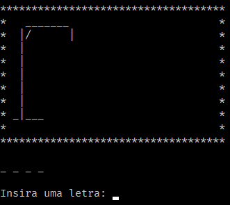
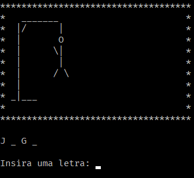

# Jogo da Forca

Este é um jogo da forca.

## Bibliotecas Utilizadas

- stdio.h;
- stdlib.h;
- locale.h;
- string.h;
- unistd.h;
- ctype.h.

## Funcionalidades

- Cadastrar palavra;
- Ranking (armazenado em disco);
    - Posição;
    - Player;
    - Número de erros;
    - Tamanho da palavra.
- Menu de Ajuda;
- Desenho da forca;
- Compatibilidade com Windows e Linux;
- Localização em PT-BR (somente Linux).

## Descrição

Ao iniciar uma partida, o programa pede o nome do jogador e qual a palavra que deve ser adivinhada pelo mesmo. Depois é mostrada a tela do jogo com o desenho de uma forca, que vai modificando dependendo dos erros do player. Ao final da partida, o arquivo "rank.txt" é criado (caso ainda não existisse) ou atualizado (se já existia) e reordenado com as novas informações.
O rank pode ser visualizado escolhendo a opção "Listar Ranking" no menu.

## Imagens do Jogo

